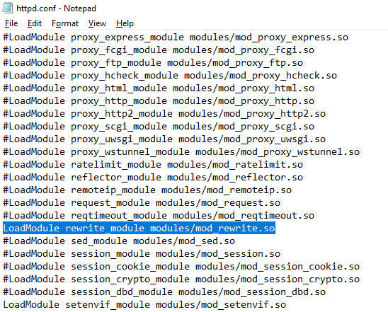
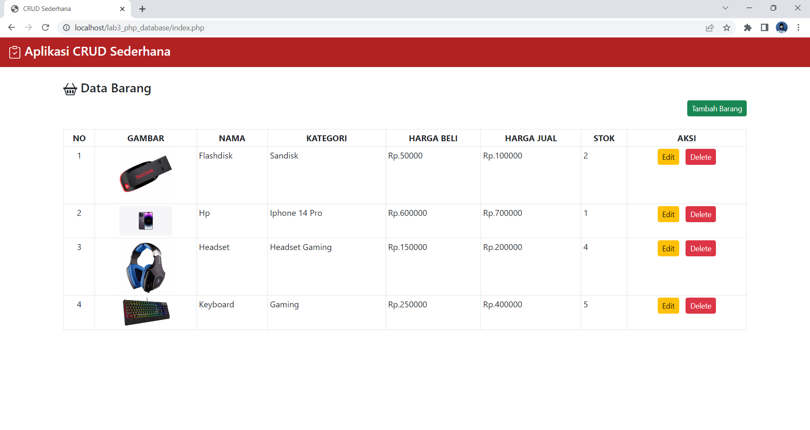
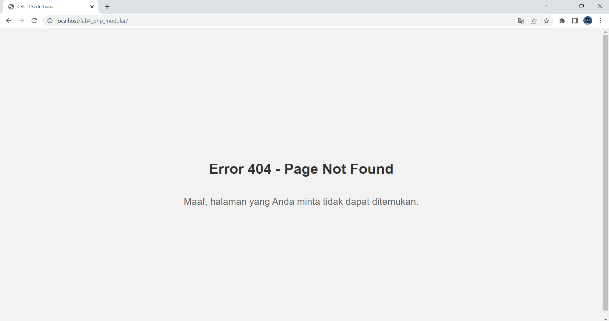

# Tugas Pemograman Web 2

## Profil

| #               | Biodata             |
| --------------- | ------------------- |
| **Nama**        | Muhamad Suryanegara |
| **NIM**         | 312110397           |
| **Kelas**       | TI.21.A.1           |
| **Mata Kuliah** | Pemrograman Web 2   |

# Persiapan

1. Persiapkan Text Editor misalnya VSCode.
2. Buat folder baru dengan nama Lab4Web pada root Web Server (htdocs).
3. Ikuti langkah-langkah praktikum yang akan dijelaskan berikutnya.

# Langkah-langkah Praktikum

- Melanjutkan pertemuan 3 atau praktikum sebelumnya, namun disini kita akan menambahkan/membuat Routing.
- Pertama, rename `index.php` menjadi `view.php` di pertemuan sebelumnya.
- Kemudian buat file baru dengan nama `index.php`, lalu masukan kode berikut.

```php
<?php
$mod = @$_REQUEST['mod'];
switch ($mod) {
  case "view":
    require("view.php");
    break;
  case "tambah":
    require("tambah.php");
    break;
 default:
 require("error.php");
}
?>
```

- Tambahkan simbol @ sebelum method `$_REQUEST` untuk menghilangkan Undefined array key error.

# Aktifasi mod_rewrite (.htaccess)

<p>Mod_rewrite digunakan untuk mengubah URL dari query string menjadi SEO Friendly.</p>

- Langkah awal yang harus disiapkan adalah aktivasi mod_rewrite pada Web Server Apache2 pada configurasi httpd.conf.



- Aktifkan LoadModule mod_rewrite dengan cara melakukan un-comment pada baris tersebut, kemudian restart Apache2.
- Langkah berikutnya adalah membuat file baru dalam folder Lab4Web dengan nama `.htaccess`, kemudian masukan kode berikut.

```.htaccess
<IfModule mod_rewrite.c>
  RewriteEngine On
  RewriteBase /LabWeb/Lab4Web
  RewriteCond %{REQUEST_FILENAME} !-f
  RewriteCond %{REQUEST_FILENAME} !-d
  RewriteRule ^(.*)$ index.php?mod=$1 [L]
</IfModule>
```

### Sekarang cara mengaksesnya menjadi:

- Halaman View (http://localhost/LabWeb/Lab4Web/view)
- Halaman Tambah Barang (http://localhost/LabWeb/Lab4Web/tambah)



# Tambahan (+)

- Buat file baru dengan nama `error.php`, kemudian tambahkan kode berikut.

```html
<!DOCTYPE html>
<html>
  <head>
    <title>CRUD Sederhana</title>
    <style>
      body {
        font-family: Arial, sans-serif;
        background-color: #f2f2f2;
        display: flex;
        align-items: center;
        justify-content: center;
        height: 100vh;
        flex-direction: column;
      }
      h1 {
        font-size: 36px;
        color: #333;
        margin-top: 50px;
      }
      p {
        font-size: 24px;
        color: #666;
      }
    </style>
  </head>
  <body>
    <h1>Error 404 - Page Not Found</h1>
    <p>Maaf, halaman yang Anda minta tidak dapat ditemukan.</p>
  </body>
</html>
```

- File tersebut berfungsi untuk menampilkan halaman error ketika pengguna salah memasukan query string.



# Terima Kasih!
